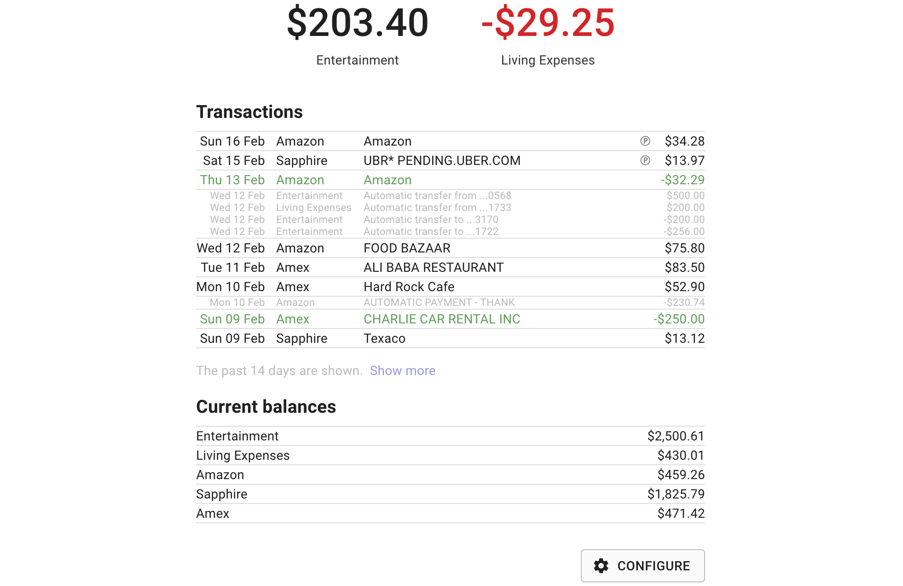
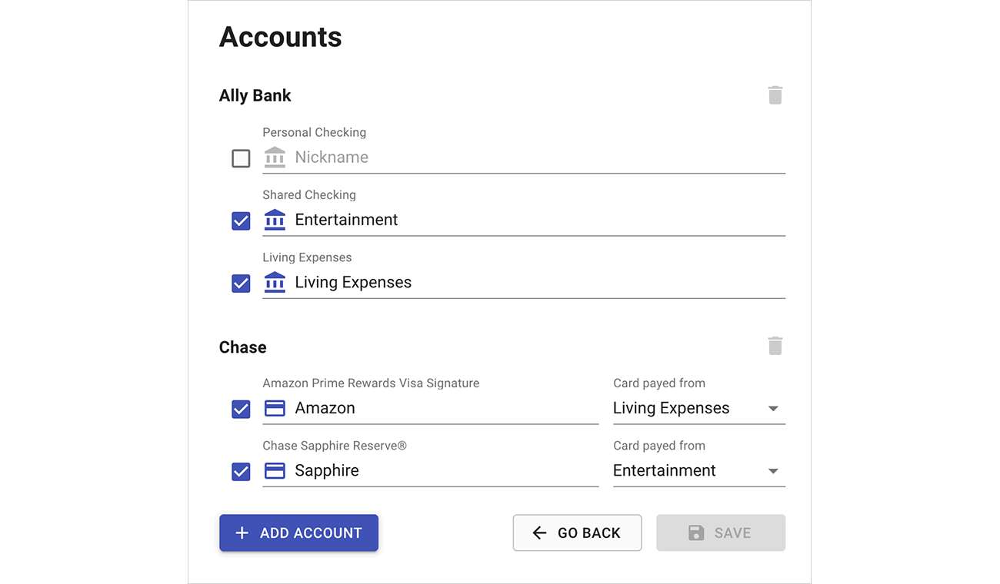

# Easy finance

Easy finance is a personal finance accounting tool.

Years ago, I tried the tool Mint, but I thought it was bloated with features I
didn't care about, and too slow for answering basic questions.

So I wrote my own tool. My partner and I use it for keeping track of our
finances on a daily basis, and it has been a complete success.

This tool may be useful to others, so here are the sources and instructions to self-host.

## Screenshot



## Features

* Shows financial transactions in near real-time
* Runs as a web applications
* Aggregates multiple checking/saving accounts with credit cards. Each credit
  card is associated with a checking account from which they get paid from.
  Each group of checking account and its associated credit cards are
  aggregated separately, and shown on top of the page for quick access
* Pending transactions are accounted in the balance, and shown with a (P)
  in the transaction list
* Automatic transfers and credit cards payments are shown is small. Refunds in
  green.
* Access to the balances is speedy with a page load is under 1 second
* Easy to configure (and reconfigure) bank accounts and credit cards
* UI implemented with the [Next.js](https://nextjs.org/) framework
* Self-host for free
* No maintenance needed

## Installation

### 1. Clone the easy-finance repository

```
git clone https://github.com/nviennot/easy-finance.git
cd easy-finance
```

### 2. Initialize settings

```
cp with_env.template.sh with_env.sh
```

* Edit the `with_env.sh` and set a password (replace the `XXX`).

### 3. Setup a Plaid account

Plaid is used to retreive all the bank data.

* Go to [plaid.com](https://plaid.com)
* Register for a new account. We will be using a free development account
* In _Team Settings_ → _Keys_, Copy the `client_id`, `public_key`, and
`developement secret` into the `with_env.sh` file

### 4. Setup a Firebase account

Firebase is used to store the application settings.

* Go to [firebase.google.com](https://firebase.google.com/) and register an account
* Create a new project. No need to connect to Analytics if asked.
* In _Develop_ →  _Database_ → _Create a new Database_. Select production mode,
  and a datacenter closest to you if asked.
* In _Settings_ → _Project Settings_ → _Service accounts_,
  click on _Generate new private key_. This should download a .json file
  Save it as `service-account-key.json` in the root of the repository
  directory
* On the same screen, you should see a `databaseURL` setting. Save it
  in the `with_env.sh` file

### 5. Test and configure the application locally

* Run the following in the repository directory

```
yarn install
source with_env.sh
npm run dev
```

* This should lunch a webserver. [localhost:3000](http://localhost:3000/)
  should show a login page
* Use the password from step 2 to log in. You should see the account page

### 6. Configure bank accounts

Configure accounts to your liking. Below shows a screenshot of what to expect.
Once configured, click on _Save_ which takes you back to the list of transactions.



### 7. Deploy to ZEIT

ZEIT is a platform that can run our application so it is accessible from
anywhere.

* Register a free account at [zeit.co](https://zeit.co/)
* Run the following in the repository directory

```
npm install -g now
now login
./deploy.sh
```

You may be asked to link your ZEIT account. Answering the default answers should
do. After a minute or so, you should see the deployed URL.

## License

Released under the MIT license.
